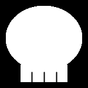
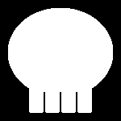
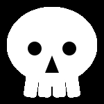

# Midterm Project - Phase 2: Translate to Processing.py Sketch

## canvas setup

The size of the canvas is 150, 150, and the background will be black
<pre>
def setup():
    size(150, 150)
    background(0)
</pre>

## Head: an ellipse filled with white

<pre>
def draw():
    fill(255)
    noStroke()
    ellipse(75, 70, 130, 110)
</pre>

## Teeth:

- first I drew a long rectangle and three lines that seperate each of teeth
<pre>
def draw():
    fill(255)
    noStroke()
    ellipse(75, 70, 130, 110)
    rect(35, 110, 80, 30) # long rectangle
    stroke(0) # to make following lines black
    line(54, 123, 54, 140) # line 1
    line(75, 123, 75, 140) # line 2
    line(96, 123, 96, 140) # line 3
</pre>

- the result is

- I didn't like it. I thickened the lines adding following line:
<pre>
strokeWeight(2)
</pre>

- the result is
'

- Also didn't like it. Instead I tried having four individual rectangles for each tooth with rounded edges.
<pre>
def draw():
    fill(255)
    noStroke()
    ellipse(75, 70, 130, 110)
    rect(36, 110, 18, 30, 0, 0, 5.2, 5.2)
    rect(56, 110, 18, 30, 0, 0, 5.2, 5.2)
    rect(76, 110, 18, 30, 0, 0, 5.2, 5.2)
    rect(96, 110, 18, 30, 0, 0, 5.2, 5.2)
</pre>

- the result is
'

- Because of the undeline ellipse for head, the lines that seperate teeth have different length. Instead of ellipse(), change to arc() for the head.

## Back to head:

- arc() has start/stop/mode parameters and I played around these parameters and figured out:
    - (PI, 2 * PI) will produce the semi-ellipse.
    - Having 0.9 * PI, 0.8 * PI, 0.7 * PI, ..., will result start point lower and lower.
    - Having 2.1 * PI, 2.2 * PI, 2.3 * PI, ..., will result stop point lower and lower.
    - mode parameter shoud be "OPEN" or "CHORD" so the start point and stop point will be connected with line.
<pre>
def draw():
    fill(255)
    noStroke()
    arc(75, 70, 130, 110, 0.65 * PI, 2.35 * PI, CHORD)
    rect(36, 110, 18, 30, 0, 0, 5.2, 5.2)
    rect(56, 110, 18, 30, 0, 0, 5.2, 5.2)
    rect(76, 110, 18, 30, 0, 0, 5.2, 5.2)
    rect(96, 110, 18, 30, 0, 0, 5.2, 5.2)
</pre>

- the result is
'

- Now I wanted to tilt the left- and right-most teeth.

## Back to teeth:

- I first used quad for left- and right-most teeth that look tilted
<pre>
def draw():
    fill(255)
    noStroke()
    arc(75, 70, 130, 110, 0.65 * PI, 2.35 * PI, CHORD)
    quad(35.5, 99, 32.5, 138, 51.5, 140, 54.5, 100)
    rect(56, 110, 18, 30, 0, 0, 5.2, 5.2)
    rect(76, 110, 18, 30, 0, 0, 5.2, 5.2)
    quad(95.5, 100, 98.5, 140, 117.5, 138, 114.5, 99)
</pre>

- the result is
'

- quad() does not support lounded edge. I went back to rect() but searched for rotating shapes.

## rotate teeth:

- I thought the left-most teeth can a tiny bit rotate clockwise, and the right-most teeth can a tiny bit rotate counterclockwise.

- having rotate() will rotate following shapes. However the center of rotation is a origin point, (0, 0), or a upper-left corner.

- I googled and found a comment in a reddit post that I have to use translate() to move origin point and pushMatrix()/PopMatrix() so the rotation only applies that rectangle.
    - [The reddit post](https://www.reddit.com/r/processing/comments/x7h9z3/how_to_rotate_line_from_its_starting_point/)

- So I have 4 groups of PushMatrix() - translate() - rotate() - rect() - popMatrix(). Each rotation center is the center of each rectangle, and each rotation degree defers.

<pre>
def draw():
    fill(255)
    noStroke()
    arc(75, 70, 130, 110, 0.65 * PI, 2.35 * PI, CHORD)
    
    pushMatrix()
    translate(45, 125)
    rotate(0.15)
    rect(-9, -15, 18, 30, 0, 0, 5.2, 5.2)
    popMatrix()
    
    pushMatrix()
    translate(65, 125)
    rotate(0.05)
    rect(-9, -15, 18, 30, 0, 0, 5.2, 5.2)
    popMatrix()
    
    pushMatrix()
    translate(85, 125)
    rotate(-0.05)
    rect(-9, -15, 18, 30, 0, 0, 5.2, 5.2)
    popMatrix()
    
    pushMatrix()
    translate(105, 125)
    rotate(-0.15)
    rect(-9, -15, 18, 30, 0, 0, 5.2, 5.2)
    popMatrix()
</pre>
M
- The code is too long, and I though I could create a loop instead of the same 4 chucks of code.

<pre>
def draw():
    fill(255)
    noStroke()
    arc(75, 70, 130, 110, 0.65 * PI, 2.35 * PI, CHORD)
    for i in range(4):
        pushMatrix()
        translate(i * 20 + 45, 125)
        rotate(i * -0.1 + 0.15)
        rect(-9, -15, 18, 30, 0, 0, 5.2, 5.20)
        popMatrix()
</pre>

- the result is
'

## eyes and nose

- Eyes are circle, nose is triangle, and they are filled with black
<pre>
fill(0)
circle(50, 60, 30)
circle(100, 60, 30)
triangle(75, 75, 65, 102, 85, 102)
</pre>

- the result is
'