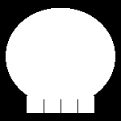

# Midterm Project - Phase 2: Translate to Processing.py Sketch

## canvas setup
The size of the canvas is 150, 150, accordingly from the instruction
<pre>
size(150, 150)
</pre>
Background will be black; the skull will be white
<pre>
background(0)
</pre>

## Head: an ellipse that has slightly longer width, filled with white
<pre>
fill(255)
noStroke()
ellipse(75, 70, 135, 120)
</pre>

## Teeth:
- first I tried a long rectangle with three lines that seperate each of teeth
<pre>
rect(33, 100, 84, 40) # long rectangle
stroke(0) # to make following lines black
line(54, 123, 54, 140)
line(75, 123, 75, 140)
line(96, 123, 96, 140)
</pre>
- the result is

- I didn't like it. I thickened the lines adding following line:
<pre>
strokeWeight(2)
</pre>
- the result is
'
- Also didn't like it. Instead I tried having four individual rectangles for each tooth with rounded edges.
<pre>
rect(34, 100, 19, 40, 0, 0, 5.2, 5.2)
rect(55, 100, 19, 40, 0, 0, 5.2, 5.2)
rect(76, 100, 19, 40, 0, 0, 5.2, 5.2)
rect(97, 100, 19, 40, 0, 0, 5.2, 5.2)
</pre>
- the result is
'
- Because of the undeline ellipse for head, the lines that seperate teeth have different length. Instead of ellipse, change to arc for the head.

## Back to head:
- I had to spend a lot of time to figure out what is start and stop parameters for art()...
<pre>
arc(75, 70, 135, 120, 0.65 * PI, 2.35 * PI, OPEN)
</pre>
- the result is
'
- Now I wanted to tilt the left- and right-most teeth.

## Back to teeth:
- replace two rectangles (left- and right-most) to quad
<pre>
quad(35.5, 99, 32.5, 138, 51.5, 140, 54.5, 100)
quad(95.5, 100, 98.5, 140, 117.5, 138, 114.5, 99)
</pre>
- the result is
'
- I still don't like but move on

## eyes and nose
- Eyes are circle, nose is triangle, and they are filled with black
<pre>
fill(0)
circle(50, 60, 30)
circle(100, 60, 30)
triangle(75, 75, 65, 102, 85, 102)
</pre>
- the result is
'

<pre>

</pre>
